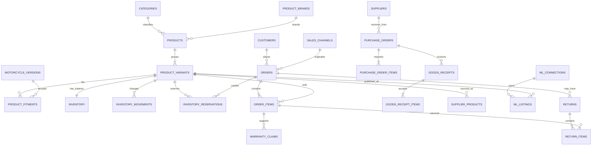

# Garage99 — Modelo de datos

Última actualización: 2026-09-06
Estado: **implementado en desarrollo; validación básica PASS; pruebas ampliadas pendientes**

Este documento define el modelo operacional de Garage99 y sirve como diccionario
de las tablas aplicadas en Supabase. `public.connection_check` y la evidencia de
conectividad corresponden al arranque técnico; la aplicación del modelo y su
validación están registradas en `docs/VALIDACION-MODELO-DB-2026-09-06.md`.

## 1. Alcance y decisiones

El modelo cubre catálogo de repuestos, compatibilidad con motocicletas,
abastecimiento, inventario, venta web y de mostrador, Mercado Libre,
devoluciones y garantías. La operación inicial contempla una ubicación física,
Chile y CLP.

Decisiones de negocio incorporadas:

- `product_variants` es la unidad vendible y el SKU es único.
- Un kit cerrado se gestiona como un SKU con inventario propio. Los kits
  armables quedan fuera del primer incremento.
- El stock es central y compartido entre `web`, `pos` y `mercadolibre`.
- Mercado Libre recibe inicialmente `max(0, available - safety_stock)`; el
  margen de seguridad comienza en una unidad por SKU y debe ser configurable.
- El carrito no reserva. El checkout crea una reserva por 15 minutos.
- Una venta confirmada consume la reserva y descuenta stock una sola vez.
- Las devoluciones solo reponen unidades después de una inspección favorable.
- Las compras aumentan stock únicamente al recibir unidades aceptadas.
- Las credenciales y tokens externos no se almacenan en tablas expuestas.

## 2. Límites de implementación

La migración inicial incorporó el catálogo, compatibilidad, abastecimiento,
inventario, pedidos, pagos, entregas, posventa e integraciones, con funciones
transaccionales para las operaciones críticas. La conexión de la web y los
proveedores externos queda para las fases siguientes.

El esquema `app` contiene datos internos. El esquema `api` contiene únicamente
vistas y funciones diseñadas para la aplicación. La configuración de Supabase
debe exponer `api` y mantener `app` fuera del acceso directo de Data API. La
tabla técnica existente `public.connection_check` se conserva como prueba de
arranque y no forma parte del dominio comercial.

## 3. Vista conceptual

## 4. Módulos y diccionario

La granularidad indicada es la unidad de una fila. Todos los identificadores
son UUID (`uuid`) salvo códigos comerciales, estados y referencias externas.
Todas las tablas tienen `created_at timestamptz not null default now()`;
las entidades mutables agregan `updated_at timestamptz not null default now()`.

### 4.1 Catálogo

| Tabla (granularidad) | Campos principales | Claves, restricciones e índices | Acceso |
|---|---|---|---|
| `app.categories` (una categoría) | `id`, `parent_category_id`, `name`, `slug`, `active` | PK; `slug` único; FK autorreferente; índice por `parent_category_id` | Lectura pública solo mediante `api.v_catalog`; escritura staff |
| `app.product_brands` (una marca de repuesto) | `id`, `name`, `slug`, `active` | PK; `slug` único; índice por nombre | Lectura pública; escritura staff |
| `app.products` (un producto agrupador) | `id`, `category_id`, `brand_id`, `name`, `slug`, `description`, `status`, `attributes jsonb` | PK; FK a categoría/marca; `slug` único; `status` en `draft/published/archived`; índice parcial de publicados | Lectura de publicados; escritura staff |
| `app.product_variants` (un SKU vendible) | `id`, `product_id`, `sku`, `name`, `barcode`, `cost_amount`, `currency_code`, `weight_grams`, `active`, `attributes jsonb` | PK; FK a producto; `sku` único y no vacío; importes no negativos; índice por `product_id`, `barcode` | Precio/catálogo público; costos solo staff |
| `app.product_images` (una imagen ordenada) | `id`, `product_id`, `variant_id`, `storage_path`, `alt_text`, `sort_order`, `is_primary` | FK a producto y variante; ruta única; un principal por producto/variante mediante índice parcial | Lectura pública de imágenes publicadas; escritura staff |

Un producto sin opciones tiene una sola variante predeterminada. No se guarda
stock en `products`; el saldo siempre pertenece a `product_variants`.

### 4.2 Compatibilidad y referencias

| Tabla (granularidad) | Campos principales | Claves, restricciones e índices | Acceso |
|---|---|---|---|
| `app.motorcycle_makes` (una marca de moto) | `id`, `name`, `slug`, `active` | PK; `slug` único | Lectura pública |
| `app.motorcycle_models` (un modelo dentro de una marca) | `id`, `make_id`, `name`, `slug`, `active` | PK; FK; único `(make_id, slug)`; índice por marca | Lectura pública |
| `app.motorcycle_versions` (una configuración modelo/motor) | `id`, `model_id`, `name`, `engine_code`, `displacement_cc`, `year_from`, `year_to`, `active` | PK; FK; años válidos; único por modelo/código/años; índice por modelo y años | Lectura pública |
| `app.product_fitments` (una compatibilidad SKU-moto) | `id`, `variant_id`, `motorcycle_version_id`, `year_from`, `year_to`, `notes`, `source_type`, `source_reference`, `verified_at` | PK; FKs; único `(variant_id, motorcycle_version_id, year_from, year_to)`; rangos de año válidos | Lectura pública; verificación staff |
| `app.part_references` (un código equivalente/OEM) | `id`, `variant_id`, `reference_type`, `reference_brand`, `reference_code`, `notes` | PK; FK; único `(reference_type, reference_brand, reference_code)`; índice normalizado por código | Lectura pública; escritura staff |

Una compatibilidad ausente significa “no verificada”, no “compatible con todo”.
Los códigos equivalentes se guardan como referencias y no reemplazan el SKU.

### 4.3 Abastecimiento

| Tabla (granularidad) | Campos principales | Claves, restricciones e índices | Acceso |
|---|---|---|---|
| `app.suppliers` (un proveedor) | `id`, `legal_name`, `display_name`, `tax_id`, `email`, `phone`, `active`, `notes` | PK; `tax_id` único cuando exista; índice por nombre | Staff |
| `app.supplier_products` (un SKU ofrecido por proveedor) | `id`, `supplier_id`, `variant_id`, `supplier_sku`, `unit_cost_amount`, `currency_code`, `lead_time_days`, `active` | PK; FKs; único `(supplier_id, variant_id)` y `(supplier_id, supplier_sku)`; costos no negativos | Staff |
| `app.purchase_orders` (una orden de compra) | `id`, `supplier_id`, `order_number`, `status`, `ordered_at`, `expected_at`, `currency_code`, `subtotal_amount`, `notes` | PK; FK; número único; estado controlado; índices por proveedor/estado | Staff |
| `app.purchase_order_items` (una línea solicitada) | `id`, `purchase_order_id`, `variant_id`, `quantity_ordered`, `unit_cost_amount`, `quantity_received` | PK; FKs; cantidades no negativas; `quantity_received <= quantity_ordered`; índice por orden/SKU | Staff |
| `app.goods_receipts` (una recepción) | `id`, `purchase_order_id`, `receipt_number`, `status`, `received_at`, `received_by`, `notes` | PK; FK; número único; recepción parcial permitida | Staff |
| `app.goods_receipt_items` (una línea aceptada/rechazada) | `id`, `goods_receipt_id`, `purchase_order_item_id`, `quantity_accepted`, `quantity_rejected`, `rejection_reason` | PK; FKs; cantidades enteras no negativas; una línea no puede exceder pendiente | Staff |

Solo `quantity_accepted` genera un movimiento de entrada. La recepción es
idempotente por documento y línea.

### 4.4 Inventario y operaciones

| Tabla (granularidad) | Campos principales | Claves, restricciones e índices | Acceso |
|---|---|---|---|
| `app.inventory` (saldo de un SKU) | `variant_id`, `on_hand`, `reserved`, `safety_stock`, `reorder_point`, `updated_at` | PK/FK a variante; enteros no negativos; `reserved <= on_hand`; índice por bajo stock | Lectura disponible pública; saldo completo staff |
| `app.inventory_operations` (una solicitud de cambio) | `id`, `idempotency_key`, `operation_type`, `variant_id`, `quantity`, `actor_user_id`, `source_type`, `source_id`, `status`, `result jsonb` | PK; clave idempotente única por actor/servicio; cantidad positiva; índice por fuente | Función controlada; no escritura directa |
| `app.inventory_movements` (un delta auditado) | `id`, `operation_id`, `variant_id`, `on_hand_delta`, `reserved_delta`, `reason`, `reference_type`, `reference_id`, `actor_user_id`, `occurred_at` | PK; FK a operación/SKU; no ambos deltas cero; índice `(variant_id, occurred_at desc)`; inmutable | Staff/auditoría |
| `app.inventory_reservations` (una reserva por pedido y SKU) | `id`, `order_id`, `variant_id`, `quantity`, `status`, `expires_at`, `reserved_at`, `released_at`, `consumed_at` | PK; FKs; cantidad positiva; estados `active/released/consumed/expired`; índice de expiración; unicidad de reserva activa por pedido/SKU | Cliente solo su pedido; operaciones por función |

La función de reserva bloquea las filas de `inventory` en orden estable, valida
`on_hand - reserved - safety_stock` y actualiza saldo, reserva, movimiento y
pedido dentro de una transacción. Repetir `idempotency_key` devuelve el
resultado previo sin duplicar efectos. PostgreSQL recomienda adquirir varios
bloqueos siempre en un orden consistente para evitar deadlocks.

### 4.5 Clientes y ventas

| Tabla (granularidad) | Campos principales | Claves, restricciones e índices | Acceso |
|---|---|---|---|
| `app.customers` (un cliente) | `id`, `auth_user_id`, `full_name`, `email`, `phone`, `tax_id`, `default_address jsonb`, `active` | PK; `auth_user_id` y email únicos cuando existan; índices normalizados | Cliente solo propio; staff |
| `app.sales_channels` (un canal) | `id`, `code`, `name`, `active`, `safety_stock_default` | PK; `code` único (`web`, `pos`, `mercadolibre`); margen no negativo | Lectura de configuración; escritura staff |
| `app.variant_prices` (precio de un SKU por canal y vigencia) | `id`, `variant_id`, `channel_id`, `currency_code`, `unit_price_amount`, `valid_from`, `valid_to`, `active` | PK; FKs; precio no negativo; vigencias no solapadas por SKU/canal; índice de precio vigente | Precio público vigente; historial staff |
| `app.orders` (un pedido) | `id`, `order_number`, `customer_id`, `channel_id`, `external_order_id`, `status`, `payment_status`, `fulfillment_status`, `currency_code`, `subtotal_amount`, `discount_amount`, `shipping_amount`, `tax_amount`, `total_amount`, `shipping_snapshot jsonb`, `placed_at`, `cancelled_at` | PK; FKs; número único; único `(channel_id, external_order_id)` cuando exista; importes no negativos | Cliente solo propio; staff |
| `app.order_items` (una línea histórica) | `id`, `order_id`, `variant_id`, `sku_snapshot`, `name_snapshot`, `quantity`, `unit_price_amount`, `discount_amount`, `tax_amount`, `line_total_amount` | PK; FKs; cantidades positivas; importes no negativos; índice por pedido/SKU | Cliente propio; staff |

La aplicación recalcula precios, impuestos y disponibilidad en servidor. El
cliente nunca determina el total final enviando valores desde el navegador.

### 4.6 Pagos, despacho y posventa

| Tabla (granularidad) | Campos principales | Claves, restricciones e índices | Acceso |
|---|---|---|---|
| `app.payment_attempts` (un intento de pago) | `id`, `order_id`, `provider`, `external_payment_id`, `status`, `amount`, `currency_code`, `requested_at`, `confirmed_at`, `raw_reference jsonb` | PK; FKs; único por proveedor/ID externo; no guardar tarjeta; índice por pedido/estado | Cliente estado resumido; proveedor/staff detalle |
| `app.refunds` (un reembolso) | `id`, `order_id`, `payment_attempt_id`, `external_refund_id`, `amount`, `status`, `reason`, `requested_at`, `completed_at` | PK; FKs; ID externo único; suma de reembolsos no excede pago confirmado | Cliente resumido; staff |
| `app.shipments` (un despacho/retiro) | `id`, `order_id`, `method`, `status`, `tracking_number`, `address_snapshot jsonb`, `shipped_at`, `delivered_at` | PK; FK; estados controlados; índice por pedido/estado | Cliente propio; staff |
| `app.returns` (una solicitud/devolución) | `id`, `order_id`, `return_number`, `status`, `reason`, `requested_at`, `received_at`, `decided_at`, `notes` | PK; FK; número único; estados controlados | Cliente propio; staff |
| `app.return_items` (una línea devuelta e inspeccionada) | `id`, `return_id`, `order_item_id`, `quantity_requested`, `quantity_received`, `quantity_restocked`, `inspection_status`, `inspection_notes` | PK; FKs; cantidades no negativas y no superiores a vendidas; índice por devolución | Cliente propio resumido; staff |
| `app.warranty_claims` (un reclamo asociado a línea) | `id`, `order_item_id`, `return_id`, `claim_number`, `status`, `issue_description`, `resolution`, `opened_at`, `closed_at` | PK; FKs; número único; estados controlados | Cliente propio; staff |

Una devolución dañada puede terminar en reembolso sin generar entrada de
inventario. Una garantía no altera stock hasta que la resolución defina una
reposición o reemplazo.

### 4.7 Mercado Libre e integración

| Tabla (granularidad) | Campos principales | Claves, restricciones e índices | Acceso |
|---|---|---|---|
| `app.ml_connections` (una cuenta conectada) | `id`, `seller_id`, `nickname`, `status`, `token_reference`, `connected_at`, `last_refreshed_at` | PK; `seller_id` único; tokens solo como referencia a secreto; índice por estado | Servicio/staff autorizado |
| `app.ml_listings` (una publicación/variación vinculada) | `id`, `connection_id`, `variant_id`, `item_id`, `variation_id`, `status`, `last_published_available`, `last_published_at` | PK; FKs; único por cuenta/item/variación y por SKU/cuenta; índice de sincronización | Servicio/staff |
| `app.integration_events` (un evento externo recibido) | `id`, `provider`, `event_type`, `external_event_id`, `resource_id`, `payload jsonb`, `received_at`, `status`, `processed_at`, `error_message` | PK; único `(provider, external_event_id)`; payload no público; índices por estado/fecha | Servicio/staff |
| `app.integration_jobs` (un trabajo de salida/reintento) | `id`, `job_type`, `entity_type`, `entity_id`, `deduplication_key`, `desired_version`, `status`, `attempts`, `next_attempt_at`, `locked_at`, `last_error` | PK; clave de deduplicación; estados `pending/running/succeeded/failed`; índices de cola | Servicio |
| `app.integration_logs` (un resultado de intento) | `id`, `job_id`, `event_id`, `request_summary jsonb`, `response_summary jsonb`, `http_status`, `succeeded`, `occurred_at` | PK; FKs; índice por trabajo/fecha; no guardar secretos | Servicio/staff |

El job de stock debe transportar una versión o timestamp lógico del saldo. Si
un job antiguo se ejecuta después de uno nuevo, no puede restaurar una cantidad
obsoleta. Los eventos entrantes se guardan antes de responder al proveedor y se
procesan de forma idempotente.

### 4.8 Acceso y auditoría

| Tabla (granularidad) | Campos principales | Claves, restricciones e índices | Acceso |
|---|---|---|---|
| `app.staff_roles` (un rol por usuario y ámbito) | `id`, `auth_user_id`, `role`, `active`, `granted_by`, `granted_at` | PK; único `(auth_user_id, role)`; roles controlados | Solo staff administrador |
| `app.audit_events` (un cambio administrativo) | `id`, `actor_user_id`, `action`, `entity_type`, `entity_id`, `before_data jsonb`, `after_data jsonb`, `request_id`, `occurred_at` | PK; índices por entidad/actor/fecha; inmutable | Auditoría autorizada |

El rol administrativo nunca se deriva de un campo que el cliente pueda editar.

## 5. Superficie `api`

La API debe exponer vistas o funciones pequeñas, no tablas internas completas:

- `api.v_catalog`: productos publicados, variante, SKU, precio vigente,
  imágenes y disponibilidad publicable.
- `api.v_product_fitments`: compatibilidades verificadas para filtros de moto.
- `api.v_order_summary`: resumen de pedidos propios sin costos ni eventos
  internos.
- `api.reserve_order`, `api.release_reservation`,
  `api.confirm_order_sale`: operaciones de inventario idempotentes.
- `api.receive_purchase`, `api.adjust_inventory`, `api.register_return`: solo
  para el rol staff autorizado.

Las vistas con datos personales deben aplicar RLS del usuario y configurarse
con `security_invoker` cuando corresponda. Las funciones sensibles deben tener
`EXECUTE` únicamente para los roles necesarios y `search_path` controlado.

## 6. Flujos de referencia

### Compra y recepción parcial

1. Staff crea una `purchase_order` con dos líneas.
2. El proveedor entrega una parte; se crea `goods_receipt` con cantidades
   aceptadas y rechazadas.
3. Una operación idempotente actualiza `quantity_received`, `inventory` y
   `inventory_movements` por lo aceptado.
4. Una segunda recepción completa el pendiente. Repetir el mismo documento no
   vuelve a aumentar el saldo.

### Venta web

1. El servidor recalcula precios y solicita una reserva de 15 minutos.
2. La función bloquea las filas de variantes en orden estable y reserva todas
   las líneas o ninguna.
3. El proveedor confirma el pago; una operación idempotente consume la reserva,
   descuenta `on_hand` y crea movimientos.
4. Se genera un `integration_job` para publicar la nueva disponibilidad en ML.
5. Expirar, cancelar o pagar dos veces compiten por la misma transición; solo
   una puede producir efectos.

### Devolución y garantía

1. Se crea `return` y se reciben las unidades.
2. Cada `return_item` se inspecciona individualmente.
3. Solo `quantity_restocked` genera entrada de inventario; la parte dañada
   conserva trazabilidad sin volver a venderse.
4. Si corresponde, `refunds` registra el dinero devuelto. La garantía se
   actualiza aparte con su resolución.

## 7. Validación ejecutada y pendiente

La validación remota básica pasó: esquema completo, RLS, vistas API, datos demo,
reserva idempotente, confirmación de venta, rollback por falta de stock y
privilegios mínimos. La evidencia está en
`docs/VALIDACION-MODELO-DB-2026-09-06.md`.

Antes de conectar la web queda pendiente ejecutar la matriz ampliada:

- SKU duplicado, FK inválida, categoría archivada y rangos de años/motor inválidos.
- Compatibilidad con varias motos, kit cerrado y consultas por año/motor.
- Dos sesiones disputando la última unidad y pedidos con líneas parcialmente agotadas.
- Expiración, cancelación, pago duplicado o tardío y concurrencia.
- Recepción repetida, devolución superior a lo vendido y reembolso duplicado.
- Conciliación entre saldos, movimientos y reservas activas.
- Aislamiento entre clientes y protección de costos y funciones administrativas.
- Evento ML duplicado, job antiguo, timeout y recuperación sin doble descuento.
